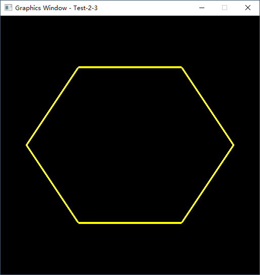
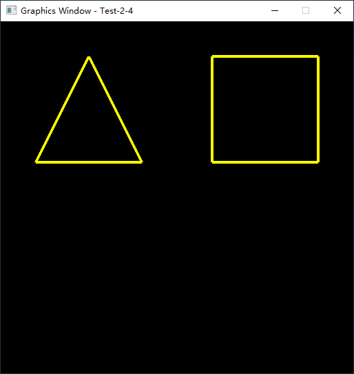
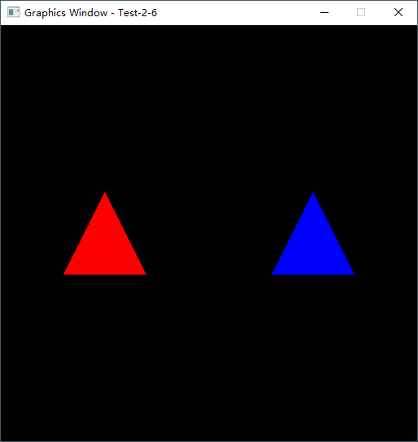
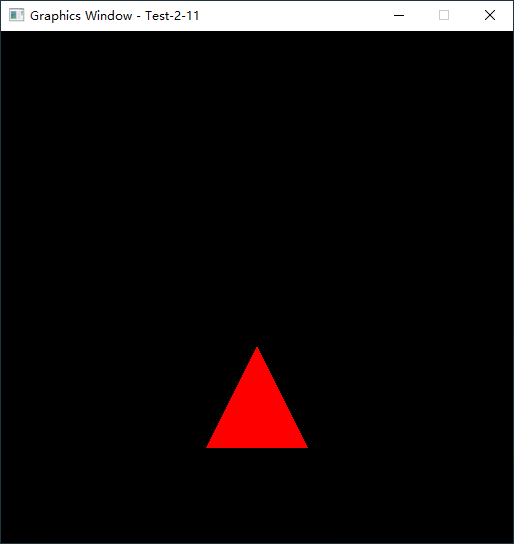
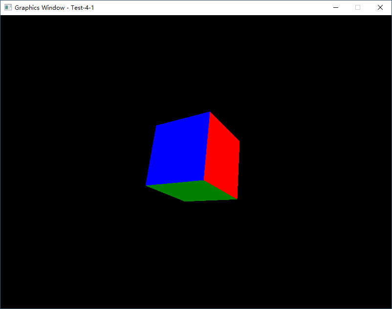

# PySide6GL

Professor Lee Stemkoski published a very good book - Developing Graphics Frameworks with Python and OpenGL.
However, the original code were using Pygame, now I'm trying to port all of the code to PySide6.

If you enjoy the code, please give my repo a star ⭐ ⬆️. 

## Requirements

* PySide6
* PyOpenGL

## Change Log

### `2027-07-28`

Refine the code and take screenshots

Upload more folders and all source code in Chapter 2, Chapter 3 and part of Chapter 4

### `2027-07-26`

Upload core folders and all source code in Chapter 2 and Chapter 3

Tested on Python 3.9.7 and Windows 10 OS
