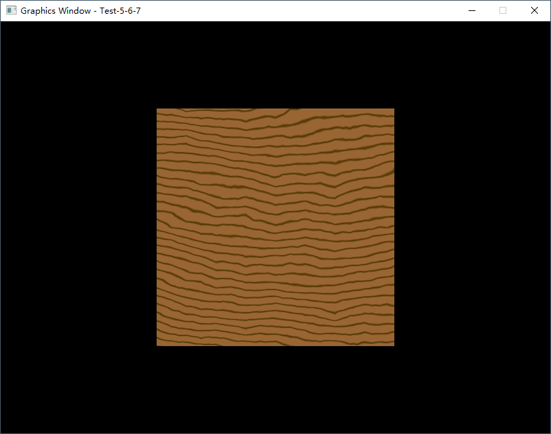
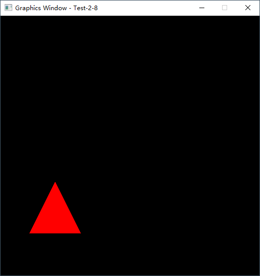
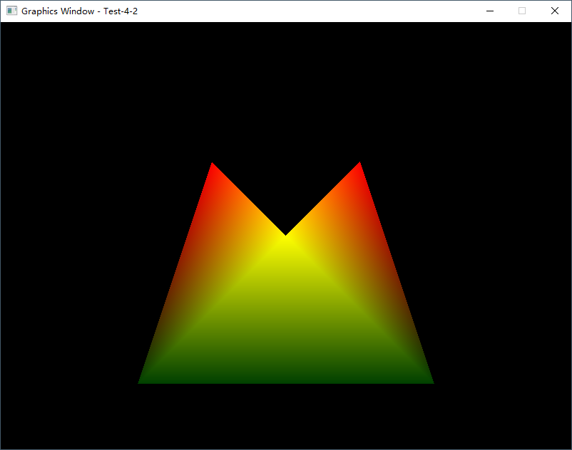

# PySide6GL

Professor Lee Stemkoski published a very good book - Developing Graphics Frameworks with Python and OpenGL.
However, the original code were using Pygame, now I'm trying to port all of the code to PySide6.

If you enjoy the code, please give my repo a star ⭐ ⬆️. 

## Acknowledgement

Thanks Timóteo Alves Cruz so much for putting all original [source code of the book](https://github.com/digitalprogrammer/PYOPENGL/ "Source code of Developing Graphics Frameworks with Python and OpenGL") except test-6-5.py on Github! 

All images come from Professor Lee Stemkoski's another [repo](https://github.com/stemkoski/Graphics-Framework-Java/ "Images files").

## Requirements

* PySide6
* PyOpenGL
* numpy
* Pillow

## Change Log

### `2022-08-03`

Finally port all code to PySide6.
Upload all source code include Chapter 6.

### `2022-08-02`

Continue to refine the code and take screenshots

Upload more folders and all source code in Chapter 5.
However, I could not make Test-5-12.py to work after replace Pygame by Pillow.

### `2022-07-28`

Refine the code and take screenshots

Upload more folders and all source code in Chapter 2, Chapter 3 and Chapter 4

### `2022-07-26`

Upload core folders and all source code in Chapter 2 and Chapter 3

Tested on Python 3.9.7 and Windows 10 OS
